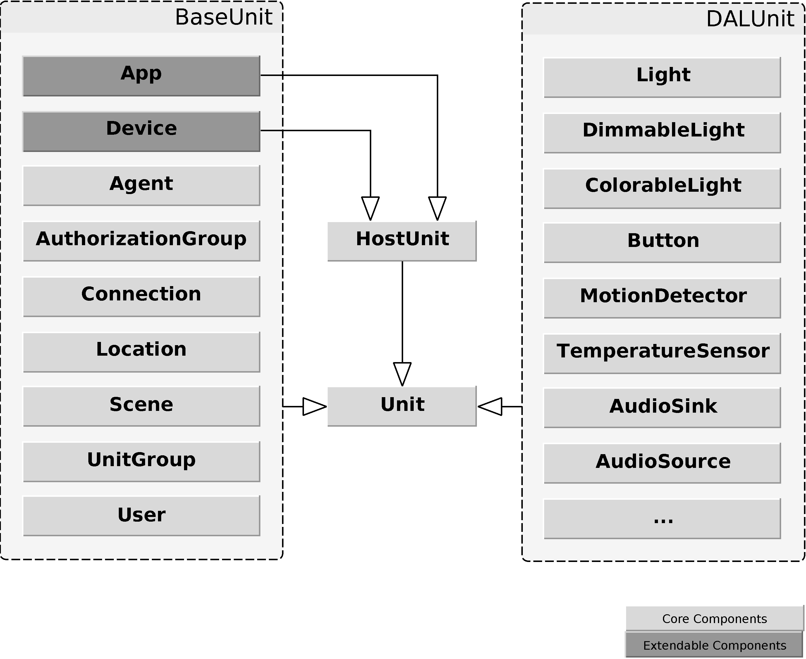
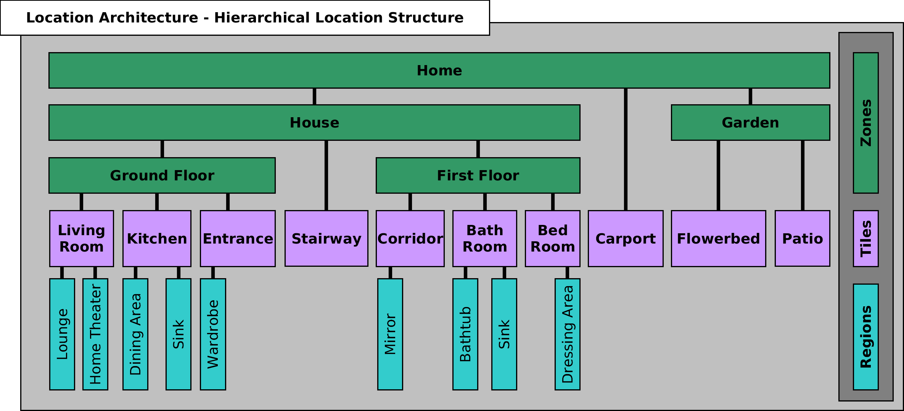
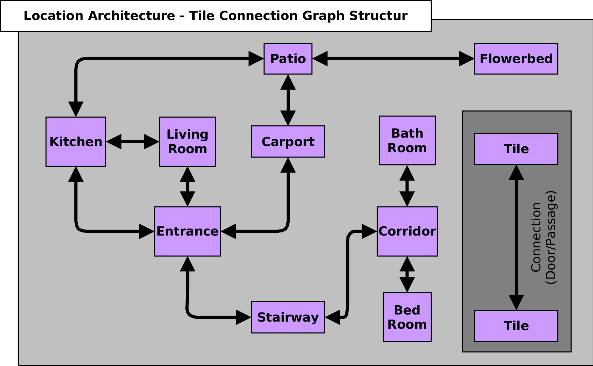
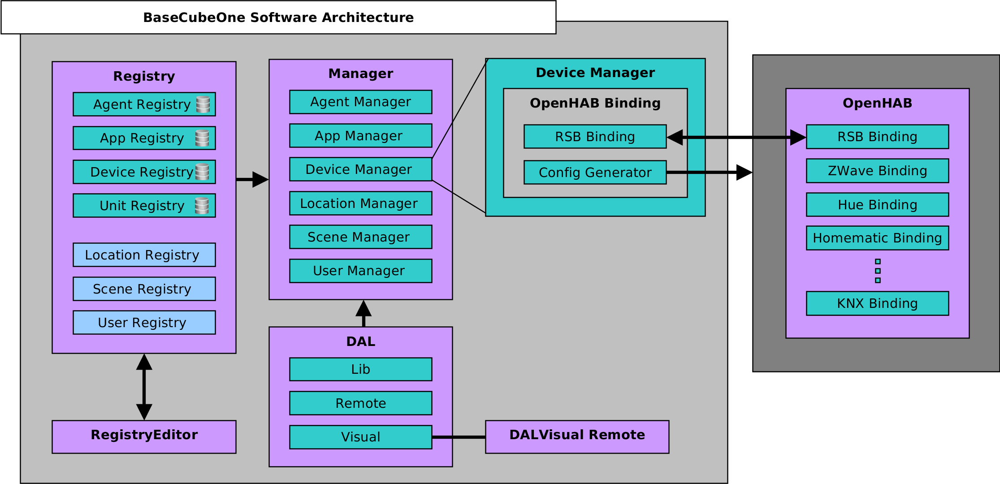

# Sotware Architecture

## Domotic Abstraction Layer (DAL)


### Unit Layer



### Service Layer

## Location Architecture






# Software Components



## Core Framework

### BCO DAL
[](https://travis-ci.org/openbase/bco.dal?branch=master)
[](https://travis-ci.org/openbase/bco.dal?branch=latest-stable)

### Maven Artifact
```xml
<dependency>
    <groupId>org.openbase.bco</groupId>
    <artifactId>dal.remote</artifactId>
    <version>[1.3,1.4-SNAPSHOT)</version>
</dependency>
```

Repository: [https://github.com/openbase/bco.dal.git](https://github.com/openbase/bco.dal.git)

### BCO Registry
[](https://travis-ci.org/openbase/bco.registry?branch=master)
[](https://travis-ci.org/openbase/bco.registry?branch=latest-stable)

### Maven Artifact
```xml
<dependency>
    <groupId>org.openbase.bco</groupId>
    <artifactId>registry</artifactId>
    <version>[1.3,1.4-SNAPSHOT)</version>
</dependency>
```

Repository: [https://github.com/openbase/bco.registry.git](https://github.com/openbase/bco.registry.git)

### BCO Manager
[](https://travis-ci.org/openbase/bco.manager?branch=master)
[](https://travis-ci.org/openbase/bco.manager?branch=latest-stable)

### Maven Artifact
```xml
<dependency>
    <groupId>org.openbase.bco</groupId>
    <artifactId>manager</artifactId>
    <version>[1.3,1.4-SNAPSHOT)</version>
</dependency>
```

Repository:[https://github.com/openbase/bco.manager.git](https://github.com/openbase/bco.manager.git)


## Developer Interfaces
```
bco-registry-editor
```
```
bco-registry-printer
```
```
bco-scene-editor
```
```
bco-visual-remote
```

## User Interfaces

### Desktop (JavaFX)
```
bcozy
```
### Android
bcomfy

# Used Libaries

## Libraries from openBase

* JPS https://github.com/openbase/jps
    * A command-line argument parser and application property management framework.
* JUL https://github.com/openbase/jul
    * A java utility library.

## Libraries from Citec (University of Bielefeld)

* RSB http://docs.cor-lab.de//rsb-manual/0.15/html/examples.html
    * The middleware used for platform independent network communication.
* RST http://docs.cor-lab.de//rst-manual/0.15/html/data-types.html
    * The data type library based on google protocol-buffers.
        * https://developers.google.com/protocol-buffers/

# Developer Setup

## Reqirements

* Java JDK 8
* Maven
* Git

## Commandline Setup

checkout ...

## IDE Setup

# Installation Guide

# Contribution
* Feel free to report [new Issues](https://github.com/openbase/bco.dal/issues/new)!
* If you are developer and you want to contribute to BCO
    * Fork the repositories, apply your features or fixes and create pull requests.
    * For long term contribution just apply for an openbase membership via support@openbase.org

# Code Examples

## Java

For running any java examples you need to include the dal remote dependency in your maven or gradle project description:

```xml
<dependency>
    <groupId>org.openbase.bco</groupId>
    <artifactId>dal.remote</artifactId>
    <version>[1.3,1.4-SNAPSHOT)</version>
</dependency>
```

### How to activate a scene
* [Complete Code Example](https://github.com/openbase/bco.dal/blob/master/example/src/main/java/org/openbase/bco/dal/example/HowToActivateAScene.java)

Request the unit
```java
    LOGGER.info("request the scene with the label \"WatchingTV\"");
    testScene = Units.getUnitByLabel("WatchingTV", true, Units.SCENE);
```
Control the unit
```java
    LOGGER.info("activate the scene");
    testScene.setActivationState(ActivationState.State.ACTIVE);
```

### How to control a colorable light 
* [Complete Code Example](https://github.com/openbase/bco.dal/blob/master/example/src/main/java/org/openbase/bco/dal/example/HowToControlAColorableLightUnit.java)

Request the unit
```java
    LOGGER.info("request the light unit with the label \"TestUnit_0\"");
    estLight = Units.getUnitByLabel("TestUnit_0", true, Units.LIGHT_COLORABLE);
```
Control the unit
```java
    LOGGER.info("switch the light on");
    testLight.setPowerState(PowerState.State.ON);
    
    LOGGER.info("switch light color to blue");
    testLight.setColor(Color.BLUE);
```
